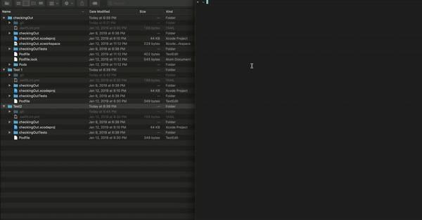

# Spread the Love!
A set of scripts that take the tediousness out of managing multiple git repos.

## Demo

## Purpose
Suppose you have many git repos that you or your team manage. It could be that you have a main project and then multiple frameworks/pods that support that main project.

Then imagine that you want to follow many "best-practices" that are supported like such things as PR-Templates or linters. You, then, probably have a PR-Template for each git repo -- what a pain when you need to update that template across all projects! 

Well, it used to be a pain -- but no longer! 

With running this project, you now can update all your PR-Templates (and other such setups) with the snap of your fingers!

## How It Works: Overview
This script asks where you want to run the script from. There is a certain folder-structure you will want for optimal performance: for best results you should have only the git-repos you want to update in an overarching folder. The script will run in a folder you specify and then it will run on all contained folders -- expecting those to be git-repos. If there is a git-repo there that you would not like to update, you can simply 'no' to the various prompts and the script will move on to the next folder. 

## Instructions
1. Update `SupportingFiles/pull_request_template.sh` as you'd like your PR-Template to read.
2. From the command line, run `sync_pr_templates.sh`. This optionally takes one argument: the location where the script should be run. If you do not add it, then you will be prompted for this at the beginning of the script.
3. Follow along with the instuctions.
4. If you did not automatically push the changes, confirm the changes and then push them up.

## License
Copyright 2019 plflanagan

Permission is hereby granted, free of charge, to any person obtaining a copy of this software and associated documentation files (the "Software"), to deal in the Software without restriction, including without limitation the rights to use, copy, modify, merge, publish, distribute, sublicense, and/or sell copies of the Software, and to permit persons to whom the Software is furnished to do so, subject to the following conditions:

The above copyright notice and this permission notice shall be included in all copies or substantial portions of the Software.

THE SOFTWARE IS PROVIDED "AS IS", WITHOUT WARRANTY OF ANY KIND, EXPRESS OR IMPLIED, INCLUDING BUT NOT LIMITED TO THE WARRANTIES OF MERCHANTABILITY, FITNESS FOR A PARTICULAR PURPOSE AND NONINFRINGEMENT. IN NO EVENT SHALL THE AUTHORS OR COPYRIGHT HOLDERS BE LIABLE FOR ANY CLAIM, DAMAGES OR OTHER LIABILITY, WHETHER IN AN ACTION OF CONTRACT, TORT OR OTHERWISE, ARISING FROM, OUT OF OR IN CONNECTION WITH THE SOFTWARE OR THE USE OR OTHER DEALINGS IN THE SOFTWARE.

